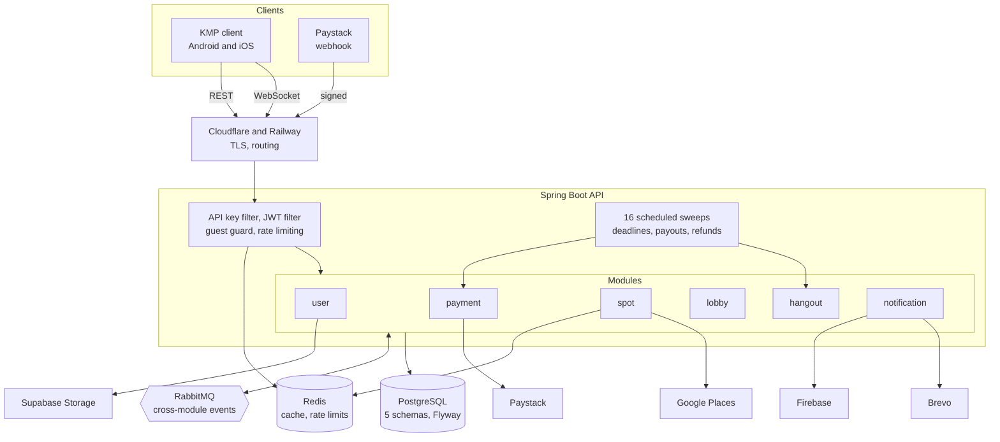
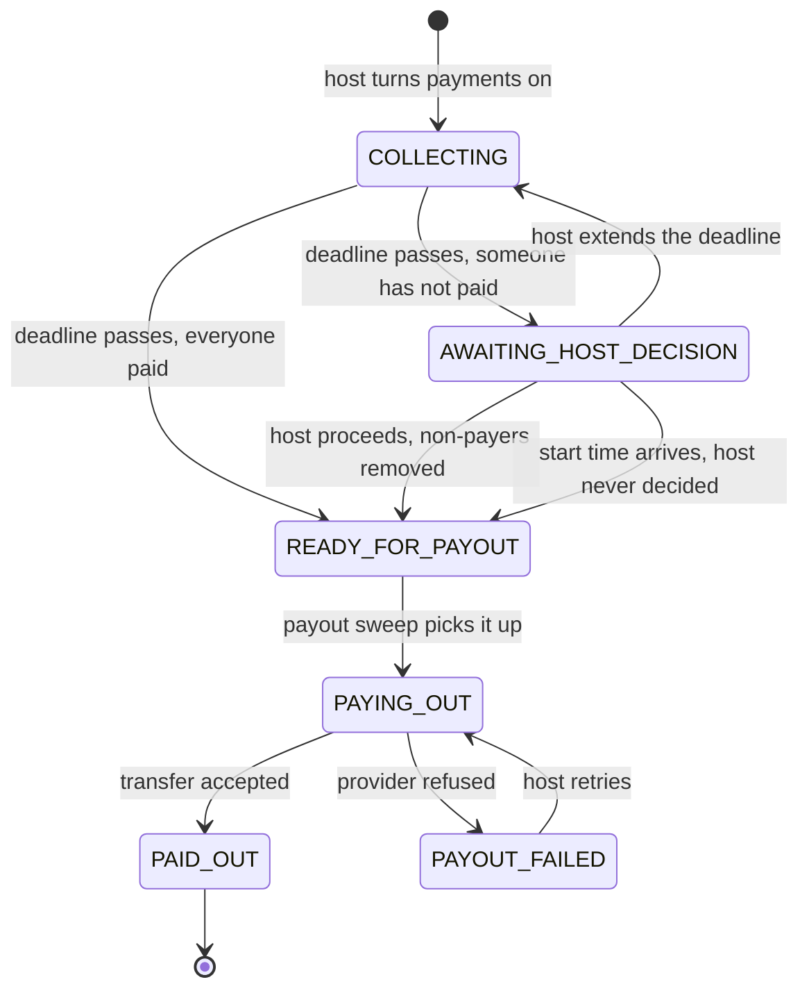
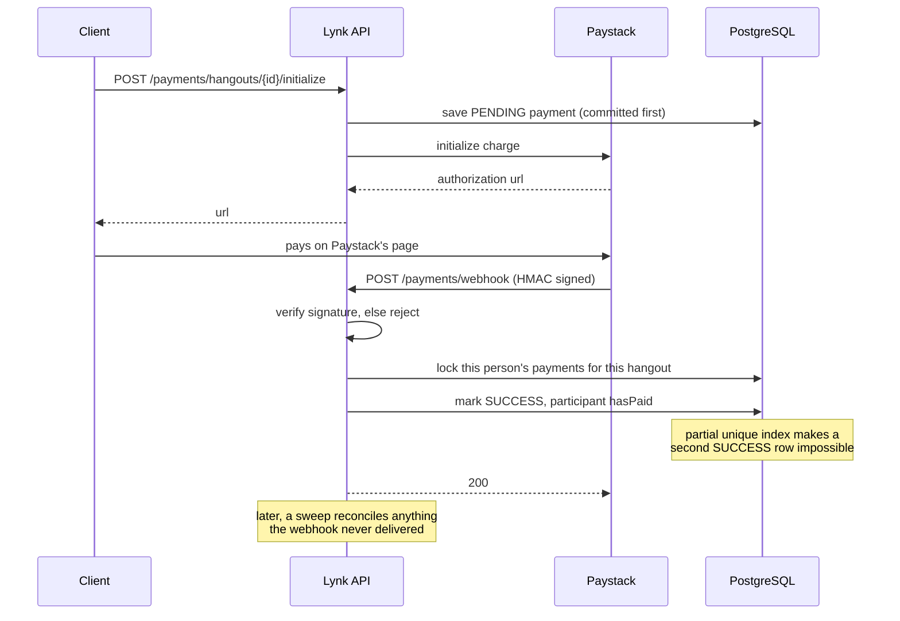
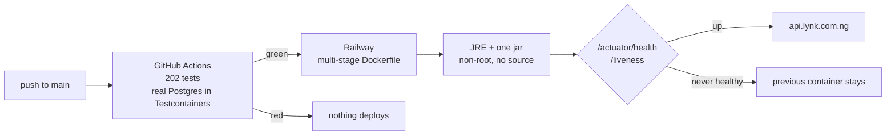

# Lynk API

Stop arguing in the group chat. Just Lynk.

Friends create a hangout, invite their squad, vote on a spot everyone can reach, split the bill, and show up. This is
the backend: a Kotlin **Spring Boot modular monolith** running in production on Railway, with a Kotlin Multiplatform
client for Android and iOS.

**Live:** https://api.lynk.com.ng · **Client:** [Lynk (KMP)](https://github.com/EEseka/Lynk)

---

## What it does

|                   |                                                                                                                                         |
|-------------------|-----------------------------------------------------------------------------------------------------------------------------------------|
| **Auth**          | Google Sign-In and guest accounts, JWT with rotating refresh tokens, plus an API key on every request                                   |
| **Hangouts**      | Create, edit, cancel, look a friend up by username and invite them, RSVP, attendee limits where a pending invite already holds the slot |
| **Spots**         | Search and trending places from Google Places, Redis-cached, saved spots per user                                                       |
| **Live lobby**    | Raw WebSockets: presence, spot proposals, live vote tallies, host tie-break                                                             |
| **Payments**      | Paystack bill-splitting: per-share charges, deadlines, host payouts, automatic refunds                                                  |
| **Notifications** | Firebase push, an in-app inbox, and transactional email through Brevo                                                                   |

## Architecture



Modules never share tables. `hangout` learns a person exists because `user` published an event, not because it can read
`user_service.users`.

### The payment state machine

Money is the part that cannot be allowed to go wrong, so every transition is either driven by a verified webhook or by a
sweep that re-reads the database rather than trusting a message.



### How a payment actually lands

The client never tells the server that it paid. Paystack does, over a signed callback.



The `PENDING` row is committed *before* Paystack is called. If those shared a transaction, and it rolled back, Paystack
would hold a live charge against a reference this database had never heard of, and the money would arrive with nothing
to attach it to.

### Modules

Eight Gradle modules. `app` is the only Spring Boot application; everything else is a library module that owns its slice
of the domain and exposes nothing but its service layer.

```
app            Spring Boot entry point, security, rate limiting, scheduling, Flyway migrations
common         shared types, events, JWT, exception handling, RabbitMQ plumbing
user           auth, profiles, API keys, Supabase Storage
hangout        hangouts, participants, invites, RSVP, the payment state machine
spot           Google Places integration, trending cache, saved spots
lobby          raw WebSocket lobby, presence, voting
payment        Paystack charges, webhooks, payouts, refunds, reconciliation
notification   FCM push, inbox rows, Thymeleaf email
```

Modules never reach into each other's tables. They talk through **RabbitMQ events** and a small set of shared types in
`common`. Each owns a separate Postgres schema: `user_service`,
`hangout_service`, `spot_service`, `payment_service`, `notification_service`.

### Things worth a closer look

**A payment lifecycle that survives failure.** Charges are confirmed by a signature-verified Paystack webhook, not by
trusting the client. Sixteen scheduled sweeps resolve deadlines, chase stuck payments, retry failed payouts, and
reconcile against the provider. A pessimistic lock plus a partial unique index on
`WHERE status = 'SUCCESS' AND refund_status = 'NONE'` makes double-charging impossible even when a webhook is delivered
twice.

**Schema owned by migrations.** Flyway builds every environment from `V1__baseline.sql`; Hibernate runs `validate`
everywhere and creates nothing, including in development. These migrations built production's database from scratch on
its first boot.

**Defence in depth.** Default-deny security, an API key filter ahead of the chain, guest accounts that cannot write,
per-IP and per-user rate limiting in Redis, and account-deletion guards that refuse to strand money mid-flight.

## Tech

**Kotlin 2.4** · **Spring Boot 4.0** · **Java 21** · PostgreSQL 17 (Supabase) · Flyway · Redis · RabbitMQ · raw
WebSockets · Paystack · Firebase Cloud Messaging · Brevo · Supabase Storage · Testcontainers · Docker · Railway

## Testing

**202 tests**, ~4,500 lines, run against **real PostgreSQL in Testcontainers**, using the same migrations and the same
schema production uses. External services are replaced with mocks; nothing else is.

```
Unit                  money arithmetic, webhook signatures, state transitions
REST journeys         auth, hangouts, participants, spots, profile, notifications
Scheduled sweeps      all 16, invoked directly, since no endpoint can reach them
Payment webhook       a signed Paystack callback driving the full state machine
Email                 all 13 template branches rendered
```

Writing them found five production bugs, including one where every webhook-triggered refund silently failed because the
write ran after its transaction had already committed.

```bash
./gradlew build        # compiles and runs everything; needs Docker running
```

## Running it

Needs **JDK 21** and **Docker**.

```bash
git clone https://github.com/EEseka/lynk-api.git && cd lynk-api
cp .env.example .env       # then fill it in
./gradlew build
SPRING_PROFILES_ACTIVE=dev ./gradlew :app:bootRun
```

API docs are served in development only, at `http://localhost:8080/swagger-ui/index.html`. They are switched off in
production, so the API surface isn't published.

### Configuration

`application.yaml` holds everything shared, `application-dev.yaml` and `application-prod.yaml` hold what differs, and
every secret arrives from the environment. Nothing sensitive is in the repository.

|                                                        |                                  |
|--------------------------------------------------------|----------------------------------|
| `POSTGRES_PASSWORD` `DATABASE_URL` `DATABASE_USERNAME` | Postgres                         |
| `SUPABASE_URL` `SUPABASE_SERVICE_KEY`                  | profile picture storage          |
| `REDIS_PASSWORD` `RABBITMQ_PASSWORD`                   | cache and message queue          |
| `JWT_SECRET_BASE64` `ADMIN_USERNAME` `ADMIN_PASSWORD`  | auth                             |
| `GOOGLE_CLIENT_ID` `GOOGLE_PLACES_KEY`                 | Google Sign-In and Places        |
| `PAYSTACK_SECRET_KEY`                                  | payments                         |
| `BREVO_API_KEY`                                        | email, over Brevo's HTTP API     |
| `FIREBASE_CREDENTIALS_JSON`                            | push, as JSON rather than a file |

## Deployment



Push to `main` → GitHub Actions runs all 202 tests → Railway builds the multi-stage Dockerfile and deploys only if they
passed. The runtime image carries a JRE and one jar: no compiler, no source, no credentials, and it runs as an
unprivileged user.

Railway polls `/actuator/health/liveness` rather than the full health endpoint, so a database blip never triggers a
restart that couldn't have helped.

## Status

Backend feature-complete and deployed. The KMP client is in progress.
